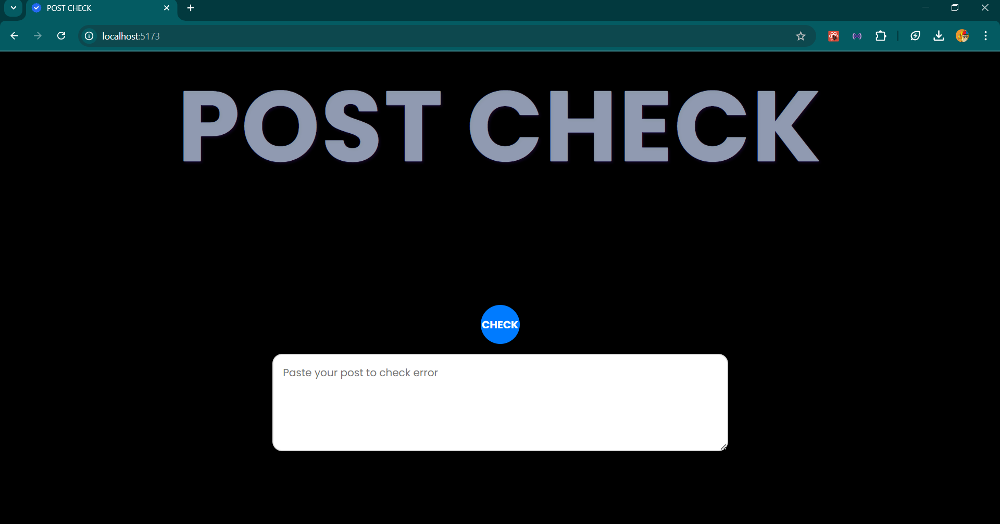

# Post-CheckApp
Ensuring error-free posts goes beyond avoiding social media backlash—this project is designed to enhance learning data for AI and machine learning models, contributing to smarter language processing and improved accuracy.

**Link to project:** https://post-checkapp.onrender.com

## How It's Made:

**Tech used:** REACT, Gemini AI

my learning focused on natural language processing (NLP), AI-powered text analysis, frontend development, API integration, and user experience optimization. I explored techniques for grammar correction, sentiment analysis, and social media compliance while improving my skills in React, JavaScript, and API handling for real-time text validation.

## Optimizations

When I improve this project, I plan to embed Twitter directly into the app, allowing users to stay within the platform while composing and checking their posts. Additionally, I will integrate the Twitter API for real-time automation and validation, replacing the traditional web intent approach. This will enhance user experience by providing instant feedback and seamless posting, making the process more efficient and interactive.

## Lessons Learned:

I learnt that best and legal practice must be ensured in all your project. I have three version of this project trying to navigate through twitter, 1. Using my experience with selenium(web scraping) at my previous employment to crawl through twitter to post 2. Using Twitter free tier which has alot of limitations on use function. 3. this Project.

## Examples:
Take a look at these couple examples that I have in my own portfolio:

**WeatherStory** http://https://myweatherstory.onrender.com/

**MARKETPLACE:** https://marketplace-dummy-frontend.vercel.app/

**PORTFOLIO:** https://adedamola-araoye.onrender.com/

